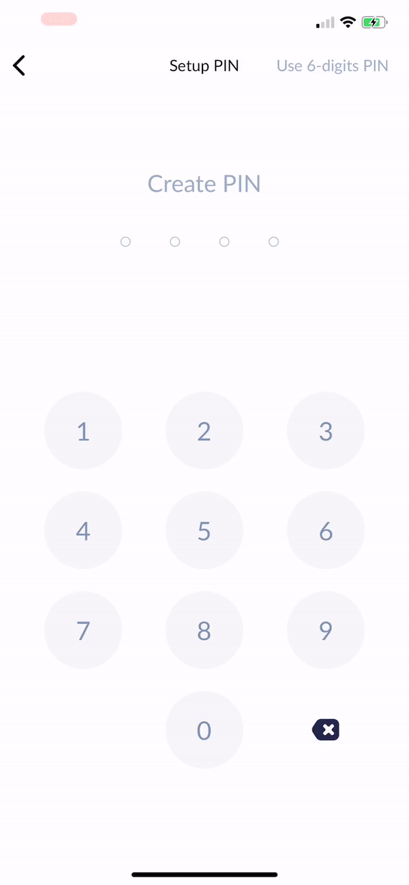

# Here is described test tasks for a android dev.

Need to implement three screens: create PIN code screen, authentication by PIN code screen and menu screen.
PIN code is sequence of integers. PIN code length is 4 digits.
For persistent storage PIN code developer can use any solution.
Every PIN code screen should have PIN code indicator and numeric keyboard. PIN code indicator - some cells that will change self color in depend on process of filling PIN code.
PIN code keyboard should have buttons from 0 to 9 and backspace button, which will remove last digit in PIN code.

PIN code indicator should react on PIN code keyboard touches. PIN code indicator should be re-rendered on PIN code changes. Every digit of PIN code should has own cell in PIN code indicator that will change color based on it filled or not. For example, user entered first digit in PIN code - PIN code indicator should change background of first cell.

## Create PIN code screen
Create PIN code screen should give ability for user to create (set) own PIN code.
For successful creation PIN code user will be needed to enter same PIN code twice and show a message with text "Your PIN code is successfully created".

See screenshots below.

 

## Authentication by PIN code screen
Authentication by PIN code screen should give ability to enter user's PIN code. Entered user's PIN code should be checked for equality with previus created (on Create PIN code screen) user's PIN code. If authentication by PIN code will be succesful user should get a message with text "Authentication success", or it was faild user should get a message "Authentication failed".

See screenshots below.

## Menu screen
Menu screen should have two buttons for navigation to Create PIN code and Authentication by PIN code screens.

